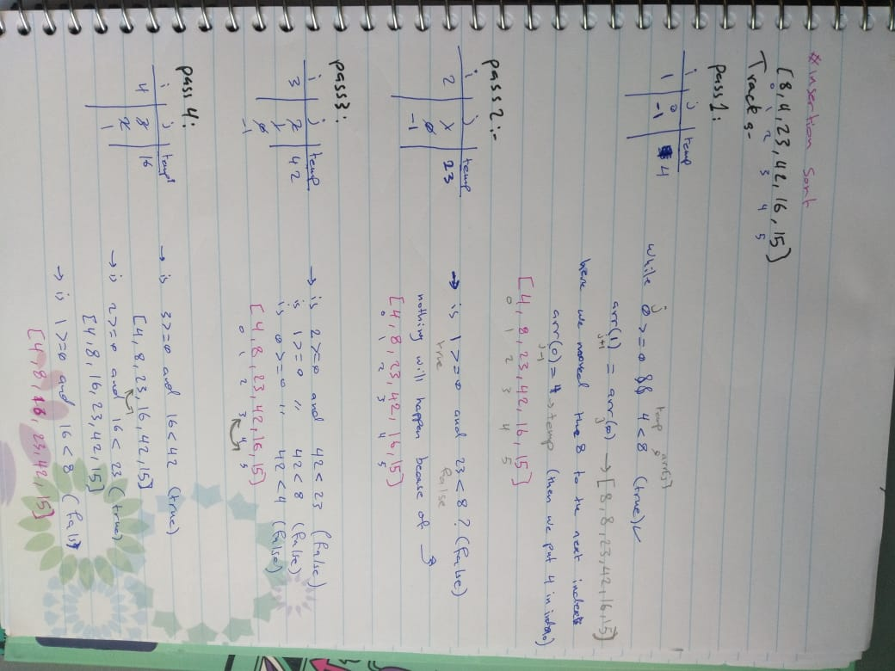
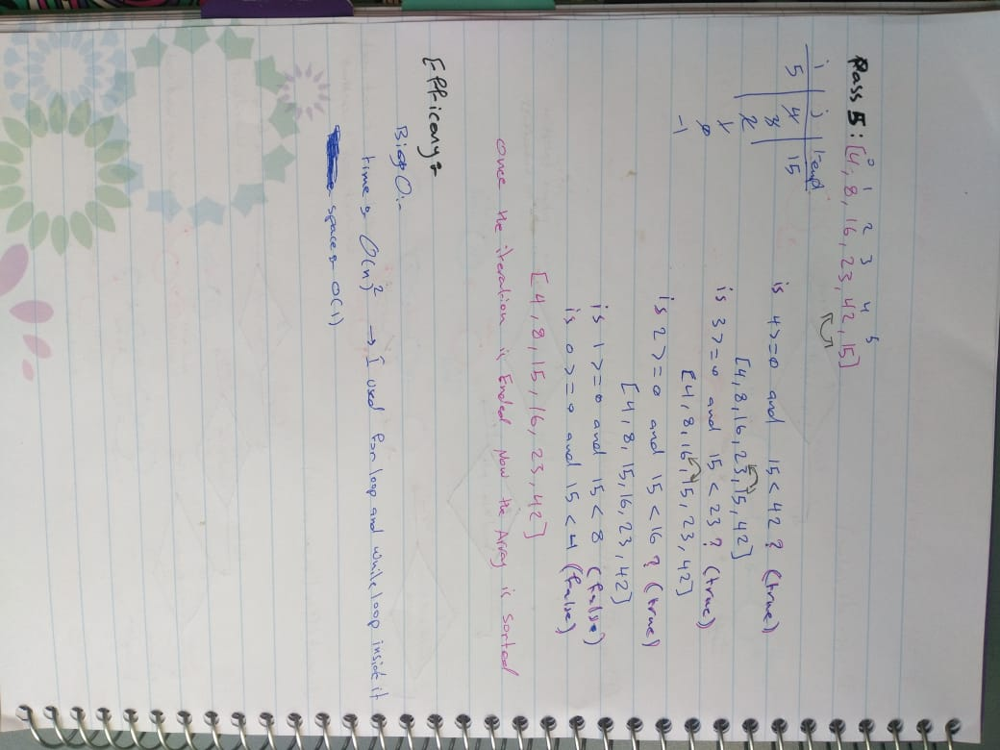

# Insertion Sort  


## 401 challenges CC 26 
  Review the pseudocode below, then trace the algorithm by stepping through the process with the provided sample array.  
  Document your explanation by creating a blog article that shows the step-by-step output after each iteration through some sort of visual.  


## Approach & Efficiency
- Big O :
   - time : O(n2)
   - space :O(1)


## Pseudocode
  ```
    InsertionSort(int[] arr)
  
    FOR i = 1 to arr.length
    
      int j <-- i - 1
      int temp <-- arr[i]
      
      WHILE j >= 0 AND temp < arr[j]
        arr[j + 1] <-- arr[j]
        j <-- j - 1
        
      arr[j + 1] <-- temp
  ```

## JavaScript Code  

  ``` 
   function insertionSort(arr){
   if(arr.length == 0){
      return 'Empty array';
   }
   for(let i=1 ; i<arr.length;i++){
      let j=i-1;
      let temp = arr[i];
      while(j>=0 && temp<arr[j]){
         arr[j+1]=arr[j];
         j=j-1;
      }
      arr[j+1]=temp;
   }
   return arr;

} 
  ```

## Solution



