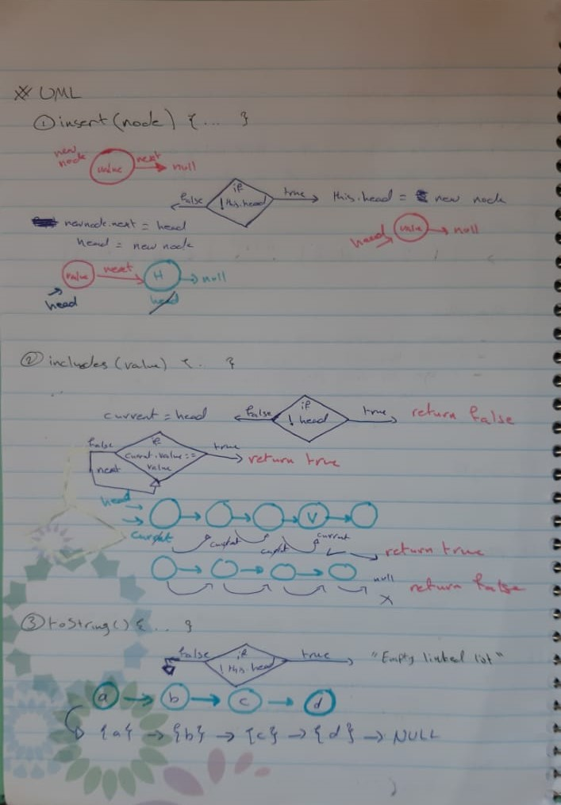
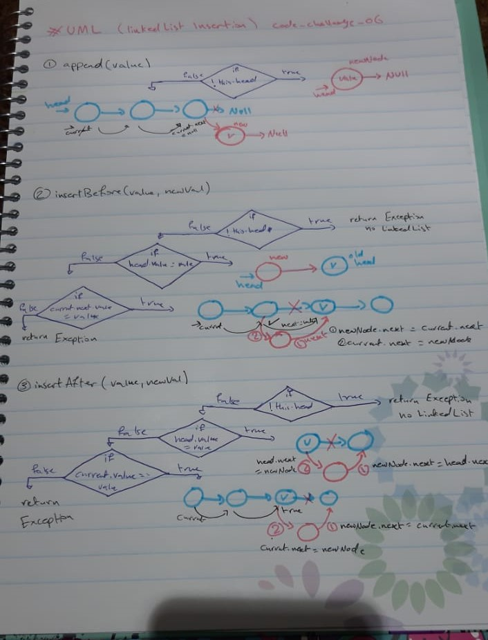

# data-structures-and-algorithms 

## 401 challenges 

# Singly Linked Lists

## Challenge
  - Create a Node class that has 2 properties (value / next)
  - LinkedList class, include a head property --> inside this class :  
     1. insert() method to insert a node onto the head of the linked list  
     2. includes() method to see if a specific value in the linked list  
     3. toString() method to return string representing all the values in the Linked List formatted as:  
    `"{ a } -> { b } -> { c } -> NULL"`  
    
     4. append() method which adds a new node with the given value to the end of the list  
     5. insertBefore() method which add a new node with the given newValue immediately before the first value node  
     6. insertAfter() method which add a new node with the given newValue immediately after the first value node

## Approach & Efficiency
- I classes 
- And while loop
- And if statment 
- Big O : 
  + insert method
     - space --> O(n)
     - time --> O(1)
  + includes method
     - space --> O(1)
     - time --> O(n)
  + toString method
     - space --> O(1)
     - time --> O(n)
  + append method
     - space --> O(n)
     - time --> O(n)
  + insertBefore method
     - space --> O(n)
     - time --> O(n)
  + insertAfter method
     - space --> O(n)
     - time --> O(n)

# UML 

