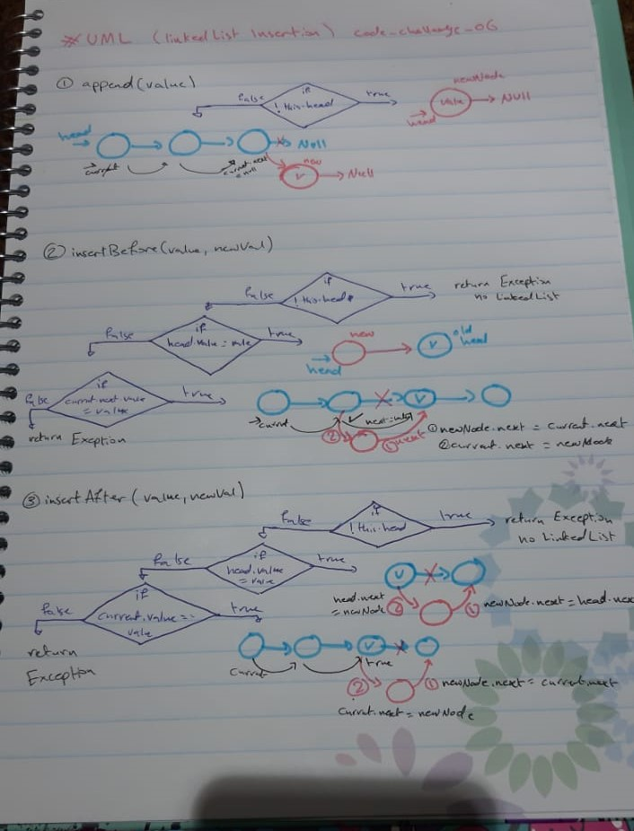

# data-structures-and-algorithms 

## 401 challenges 

# Linked Lists Insertion

## Challenge

  - extend a class from LinkedList class, and it includes these methods  :  

     1. append() method which adds a new node with the given value to the end of the list  
     2. insertBefore() method which add a new node with the given newValue immediately before the first value node  
     3. insertAfter() method which add a new node with the given newValue immediately after the first value node

## Approach & Efficiency
- I used classes 
- And while loop
- And if statment 
- Big O : 
  + append method
     - space --> O(n)
     - time --> O(n)
  + insertBefore method
     - space --> O(n)
     - time --> O(n)
  + insertAfter method
     - space --> O(n)
     - time --> O(n)

# UML 

