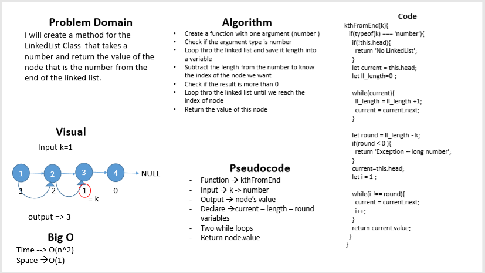

# data-structures-and-algorithms 

## 401 challenges 

# ll-kth from End

## Challenge
   
  Write a method for the Linked List class which takes a number (k) as a parameter.  
  Return the node’s value that is k from the end of the linked list.

## Approach & Efficiency
- I used classes (inheretance) 
- And while loop
- And if statment 
- Big O : 
  + kthFromEnd method
     - space --> O(1)
     - time --> O(n^2)

 
# whiteboard

