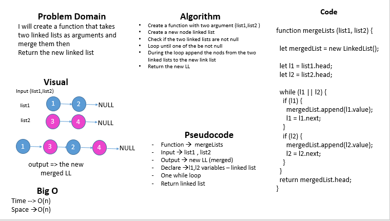

# data-structures-and-algorithms 

## 401 challenges 

# llMerge

## Challenge
   
  Write a function takes two linked lists as an arguments and merge them
  Return the new linked list

## Approach & Efficiency 
- I used while loop
- And if statment 
- Big O : 
     - space --> O(n)
     - time --> O(n)

 
# whiteboard

