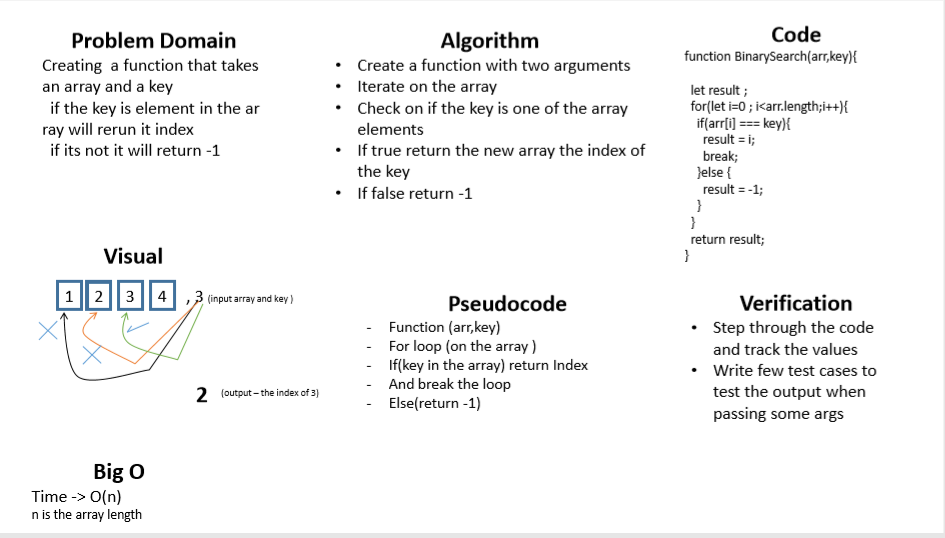

# data-structures-and-algorithms 

## 401 challenges 

# Binary search in a sorted 1D array

## Challenge
  a function that takes an array and a key  
  if the key is element in the array will return it index  
  if its not it will return -1

## Approach & Efficiency
- I used for loop
- And if statment 
- O(n) "n is the length of the array"

## Solution

