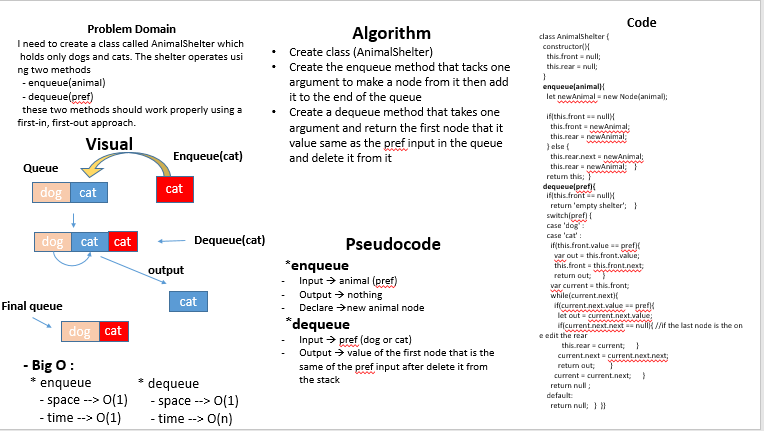

# fifo animal shelter

## Challenge
I need to create a class called AnimalShelter which holds only dogs and cats. The shelter operates using two methods
  - enqueue(animal)  
  - dequeue(pref)  
  these two methos should work properly using a first-in, first-out approach.

## Approach & Efficiency
- I used classes and if statments and while loops 
- Big O : 
  + enqueue 
     - space --> O(1)
     - time --> O(1)
  + dequeue 
     - space --> O(1)
     - time --> O(n)

# UML

