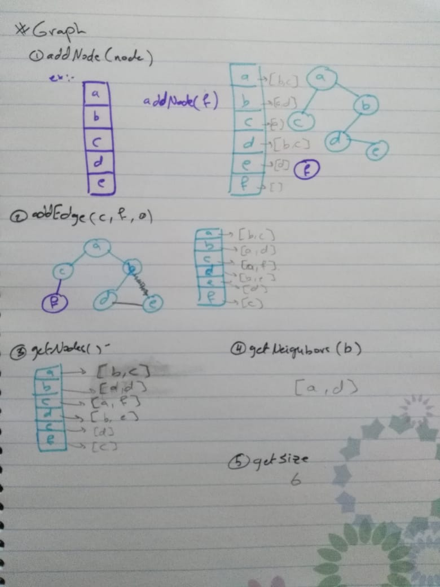

# Graph  

## 401 challenges 

## Challenge
  Implement your own Graph. The graph should be represented as an adjacency list, and should include the following methods:  

  1. AddNode():  
     - Adds a new node to the graph  
     - Takes in the value of that node  
     - Returns the added node  
  2. AddEdge():  
     - Adds a new edge between two nodes in the graph  
     - Include the ability to have a “weight”  
     - Takes in the two nodes to be connected by the edge  
     - Both nodes should already be in the Graph  
  3.GetNodes(): Returns all of the nodes in the graph as a collection (set, list, or similar)  
  4. GetNeighbors():  
     - Returns a collection of edges connected to the given node  
     - Takes in a given node  
     - Include the weight of the connection in the returned collection  
  5. Size() :  
     Returns the total number of nodes in the graph  

## Approach & Efficiency
- I used for Classes ,loops , if statment
- Big O 
  - AddNode
   + space(n) 
   + time(1) 
  - AddEdge
   + space(1) 
   + time(1) 
  - GetNodes
   + space(1) 
   + time(n) 
  - GetNeighbors
   + space(1) 
   + time(1)  
  - Size()
   + space(1) 
   + time(1) 

## Solution
  

