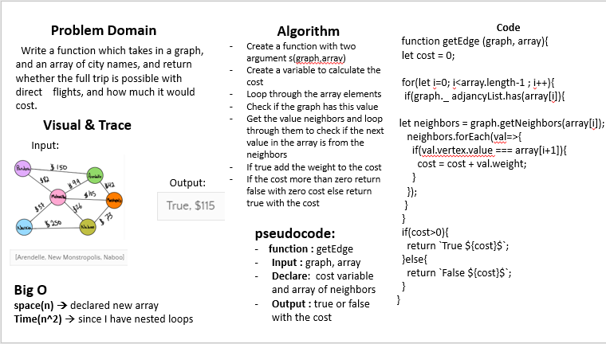

# Graph  

## 401 challenges 

## Challenge
  Write a function which takes in a graph, and an array of city names, and return whether the full trip is possible with direct flights, and how much it would cost.

## Approach & Efficiency
  - I used for loops , if statment
  - Big O 
   + space(n) declare an array 
   + time(n^2) nested loops  
  

## Solution
  

