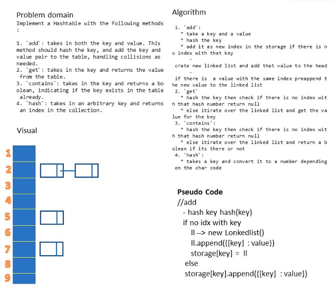

# Hashmap 

## 401 challenges 

## Challenge
  Implement a Hashtable with the following methods:

  1. add: takes in both the key and value. This method should hash the key, and add the key and value pair to the table, handling collisions as needed.  
  2. get: takes in the key and returns the value from the table.  
  3.contains: takes in the key and returns a boolean, indicating if the key exists in the table already.  
  4. hash: takes in an arbitrary key and returns an index in the collection.  

## Approach & Efficiency
- I used for Classes ,loops , if statment
- Big O 
  - add
   + space(n) if we creat a new linked list 
   + time(1) 
  - get
   + space(1) 
   + time(n) because of the forEach method 
  - contain
   + space(1) 
   + time(n) because of the forEach method 
  - hash
   + space(1) 
   + time(n) because of the reduce method  

## Solution
  

