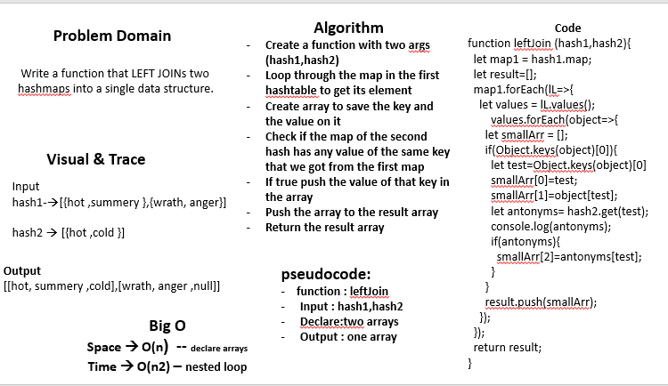

# LeftJoin   

## 401 challenges 
 

## Challenge
  Write a function that LEFT JOINs two hashmaps into a single data structure.     

## Approach & Efficiency
- I used for loops , if statment
- Big O 
  - time : O(n)
  - space : O(n)

## Solution
  

