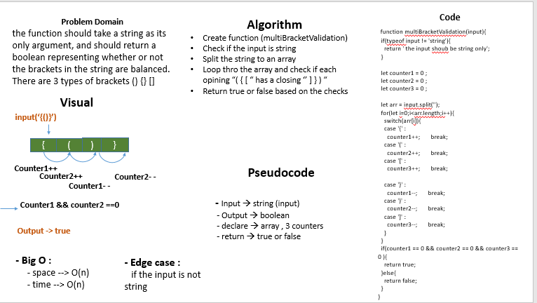

# multi-bracket-validation

## 401 challenges 

## Challenge
  the function should take a string as its only argument, and should return a boolean representing whether or not the brackets in the string are balanced. There are 3 types of brackets () {} []

## Approach & Efficiency
- I used for loop ,switch , if statment
- Big O 
   + space(n) because I declared an array 
   + time(n) because I used for loop 

## Solution

