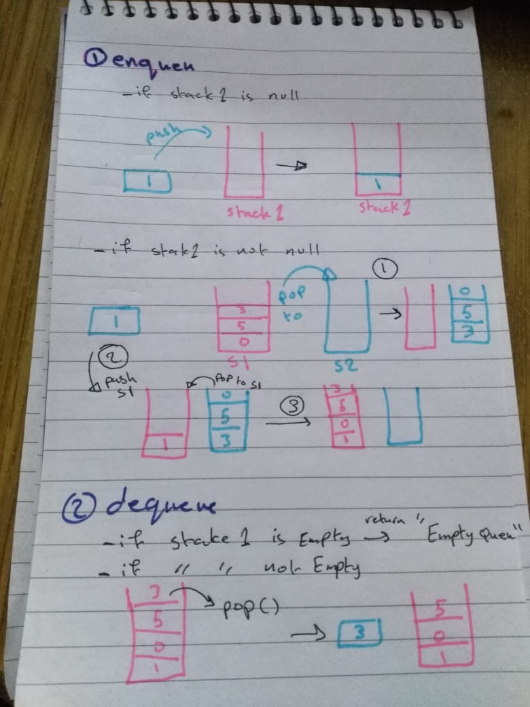

# Stacks and Queues

## Challenge
I need to create a class (PseudoQueue) with two objects (stacks) and two methods 
  - enqueue  
  - dequeue  
  these two methos should work propoply using the 2 stacks whit (pop , push , peek) methods 

## Approach & Efficiency
- I used classes and if statments and while loops 
- Big O : 
  + enqueue 
     - space --> O(n)
     - time --> O(n)
  + dequeue 
     - space --> O(1)
     - time --> O(1)

# UML

