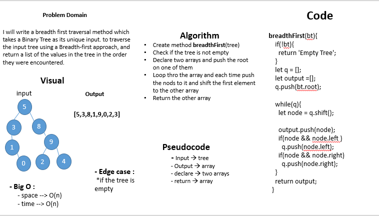

# breadthFirst

## Challenge
I will write a breadth first traversal method which takes a Binary Tree as its unique input.  
to traverse the input tree using a Breadth-first approach,  
and return a list of the values in the tree in the order they were encountered.  

## Approach & Efficiency
- I used classes, functions, while and if statments 
- Big O : 
     - space --> O(n)
     - time --> O(n)

# whiteboard

