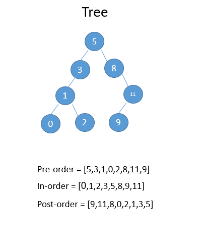
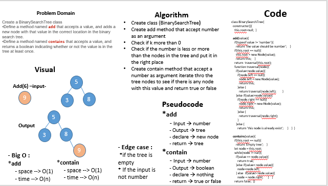

# Tree

## Challenge
I need to create two classes for BT and BST with thies methods 
  - preOrder
  - inOrder 
  - postOrder 
  - add
  - contains

## Approach & Efficiency
- I used classes, functions, while and if statments 
- Big O : 
  + preOrder
     - space --> O(n)
     - time --> O(n)
  + inOrder
     - space --> O(n)
     - time --> O(n)
  + postOrder
     - space --> O(n)
     - time --> O(n)
  + add
     - space --> O(1)
     - time --> O(n)
  + contains
     - space --> O(1)
     - time --> O(n)

# whiteboard

