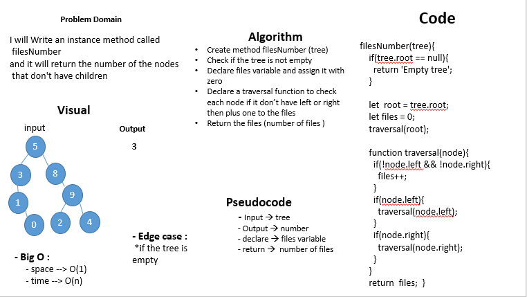

# NumberOfFiles

## Challenge
I will Write an instance method called filesNumber 
and it will return the number of the nodes that don't have children

## Approach & Efficiency
- I used classes, functions, and if statments 
- Big O : 
     - space --> O(1)
     - time --> O(n)

# whiteboard

