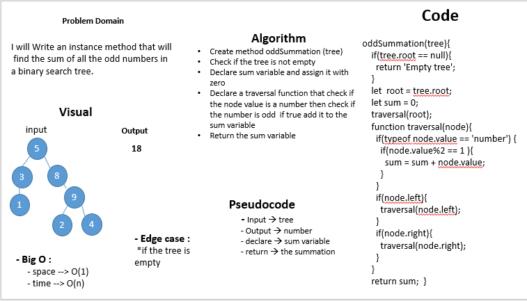

# breadthFirst

## Challenge
I will Write an instance method that will find the sum of all the odd numbers in a binary search tree. 

## Approach & Efficiency
- I used classes, functions, and if statments 
- Big O : 
     - space --> O(1)
     - time --> O(n)

# whiteboard

